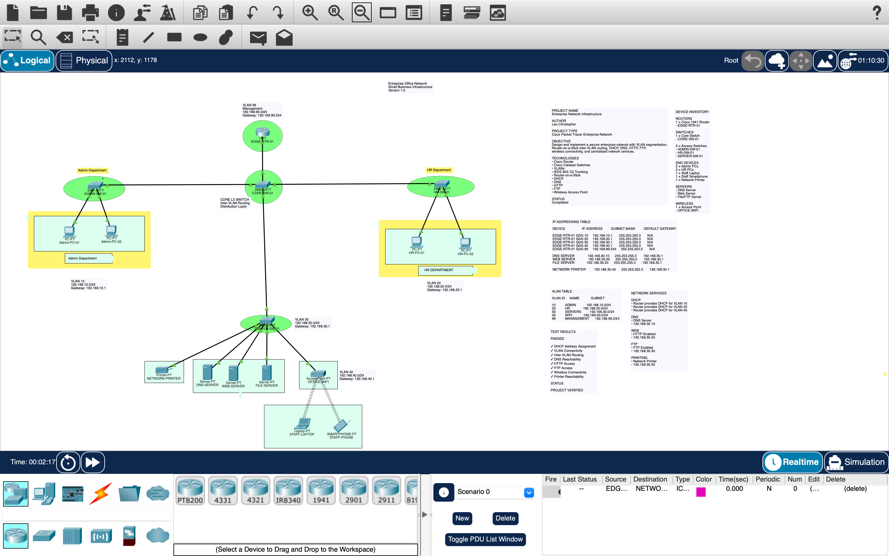

# Enterprise Office Network Infrastructure

## Overview

This project demonstrates the design and implementation of a small enterprise office network using Cisco Packet Tracer.

## Features

- VLAN Segmentation
- Router-on-a-Stick
- DHCP
- DNS Server
- Web Server
- FTP Server
- Wireless Access Point
- Network Printer
- Inter-VLAN Routing
- Enterprise Documentation

## Network Topology

## VLANs

| VLAN | Purpose |
|------|----------|
|10|Admin|
|20|HR|
|30|Servers|
|40|WiFi|
|99|Management|

## Services

- DHCP
- DNS
- HTTP
- FTP

## Devices

- Cisco 1941 Router
- Cisco Catalyst 2960 Switches
- DNS Server
- Web Server
- FTP Server
- Wireless Access Point
- Network Printer
- Desktop PCs
- Laptop
- Smartphone

## Skills Demonstrated

- Enterprise Network Design
- VLAN Configuration
- IEEE 802.1Q Trunking
- Router-on-a-Stick
- DHCP Configuration
- Static IP Addressing
- DNS Configuration
- Web Server Configuration
- FTP Configuration
- Network Troubleshooting
- Documentation

## Author

**Leo Christopher**
